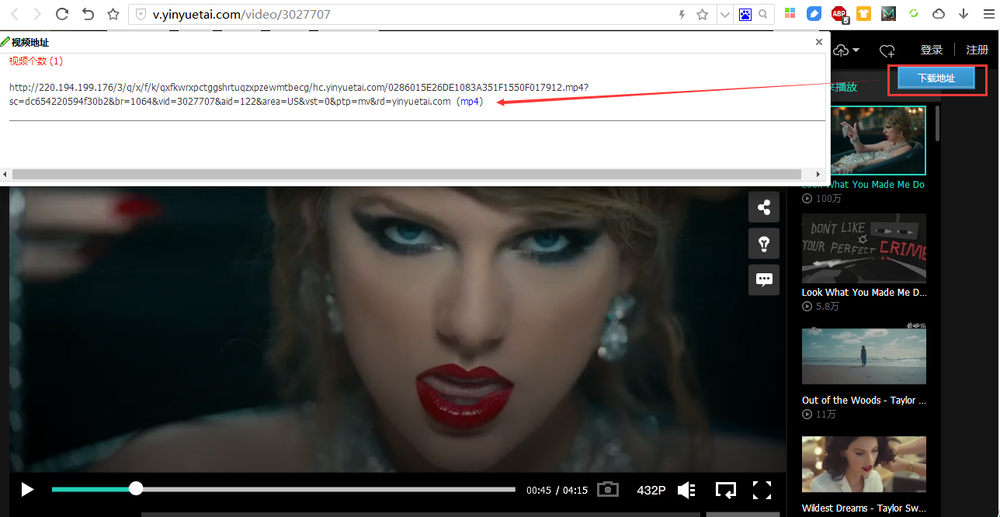
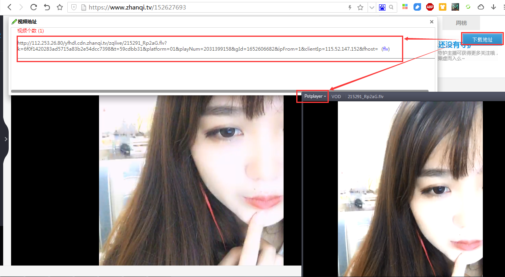

# chrome扩展开发

本项目的github地址：[https://github.com/wangli0/chrome_ex](https://github.com/wangli0/chrome_ex)

本项目的oschina地址：[https://gitee.com/need88.com/chrome_ex](https://gitee.com/need88.com/chrome_ex)

### 已打包扩展列表 :arrow_down:
- [x] [在线视频解析](crx/video_parse_v0.1.crx)
- [ ] 广告拦截
- [ ] 12306抢票

### 案例展示[在线视频解析]

### 参考资料 :zap:
- :link: [Chrome插件开发文档](https://developer.chrome.com/extensions)
- :link: [360安全浏览器开发文档](http://open.se.360.cn/open/extension_dev/overview.html)
- :link: [360极速浏览器开发文档](http://open.chrome.360.cn/extension_dev/overview.html)
- :link: [chrome插件Demo](https://github.com/sxei/chrome-plugin-demo)

### 感谢
- :link: [柳夏南](http://blog.liuxianan.com/chrome-plugin-develop.html)
